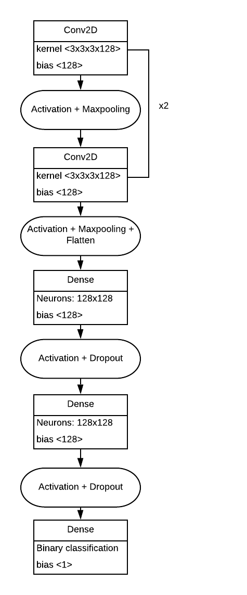

### Dataset
Dataset can be found [here](https://www.kaggle.com/techsash/waste-classification-data "Dataset reference"). The dataset has the following structure:
```bash
├── DATASET/
│   ├── TEST/
│   │   ├── O/
│   │   └── R/
│   ├── TRAIN/
│   │   ├── O/
│   │   └── R/
└── 
```
* Composition of the dataset:
    * TRAIN:
        * O: 12565 images
        * R: 9999 images
    * TEST: 
        * O: 1401 images
        * R: 1112 images


### Getting started
* Download the dataset
* Pre-processing the data present in the dataset
* Training a neural network model on the pre-processed data and saving the best model
* Loading the saved model and predicting results
* Making use of the [```API```](api.py) to classify images sent from the android application

* For detailed explanation kindly checkout [```waste-classification.ipynb```](waste-classification.ipynb "iPython notebook"). The notebook contains data pre-processing, training a neural network and testing it using some more images present in the test dataset.

### Model Architecture

